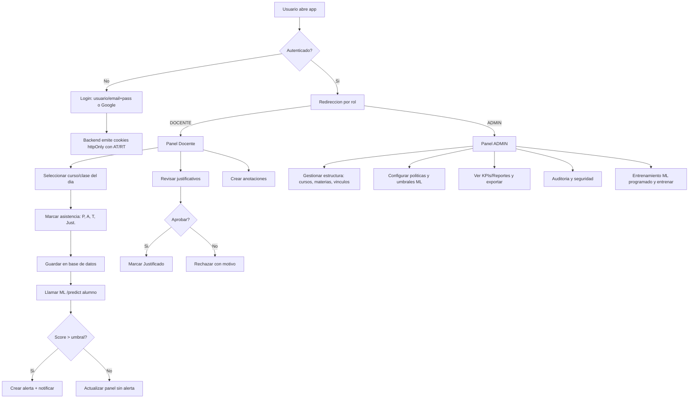

## Alcance funcional y roles

### Diagrama de flujo (alto nivel)

### Funcionalidades por rol

#### ADMIN
- Gestión institucional: cursos, materias, turnos, vínculos docentes-estudiantes-padres, importación CSV.
- Usuarios y roles: altas/bajas/modificaciones, reseteo de contraseña, bloqueo/desbloqueo, verificación de email.
- Configuración: políticas de asistencia (tolerancias/estados/reglas), plantillas de correo, calendario (feriados, exámenes), dominios de email.
- KPIs y reportes: asistencia promedio, puntualidad, evolución; filtros y exportación CSV.
- ML: panel global de riesgo, umbrales, disparar reentrenamiento, explicaciones y métricas del modelo, monitoreo de drift.
- Auditoría/seguridad: logs de acciones críticas, políticas de retención, backups/restauración.
- Notificaciones: activar/desactivar canales (email, opcional WhatsApp), listar alertas.

#### DOCENTE
- Agenda/Clases: ver clases del día; abrir toma de asistencia.
- Asistencia: marcar P/A/T/Justificado; edición del día; comentarios; carga rápida.
- Justificativos: revisar, aprobar/rechazar con motivo; historial por estudiante.
- Anotaciones: registrar observaciones con severidad y visibilidad; historial.
- Riesgo (ML): ver score 0–100 por alumno, explicaciones, recomendaciones; alertas al cruzar umbral.
- Comunicación: notificaciones en app/email; atajos de contacto a padres.
- Reportes del curso: asistencia por rango, puntualidad, exportación.

